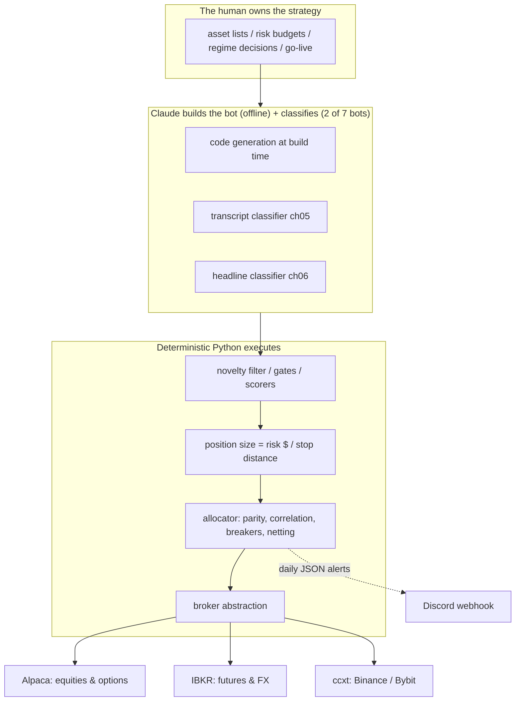

# Architecture

> **Claude builds the bot. Deterministic Python rules execute the bot.
> The human owns the strategy.** (Chapter 6 — the load-bearing sentence)

Claude sits in the loop where it has an edge: reading context (a headline, a
transcript) into a structured label. It is out of the loop wherever numerical
exactness matters: position size, stop placement, order routing. Fluent is the
wrong tool for arithmetic — that's how you get imaginary volatility numbers
(the Faroutman failure mode, ch06/ch10). And no model owns the top layer: which
asset, which regime, which risk budget deserves real money is the human's call.

## The chassis (ch02)

One `live_mode` flag guards everything, `False` by default, flippable only by
a code change with an explicit confirmation string (ch02). Paper mode
simulates fills locally and never calls a broker.

## Where Claude sits per strategy (ch06 §"where each of the seven")

| Strategy | Claude on the trade path? | Inferences/trade | Cost/trade |
|---|---|---|---|
| Trend (ch03) | No — mechanical | 0 | $0.00 |
| Pairs (ch04) | No — statistics | 0 | $0.00 |
| PEAD (ch05) | Yes, sparing | ~1 | ~$0.05 |
| News (ch06) | Yes, heavy | ~20 | ~$0.36 |
| Flow (ch07) | No — Greeks are arithmetic | 0 | $0.00 |
| Cash-and-carry (ch08) | No — exchange data | 0 | $0.00 |
| Allocator (ch09) | No — governance only, off the trade path † | 0 | $0.00 |

† The allocator (ch09) calls Claude *only* in weekly governance review (~10–20
calls per week — supervision and strategy rotation, never the millisecond trade
path), so it makes **zero per-trade runtime inferences**.

So **five of the seven bots make zero inference calls on the runtime trade
path** — trend, pairs, flow, cash-and-carry, and the allocator (governance is
off that path). The **two** that call Claude per trade are **PEAD** (ch05) and
**News** (ch06) — the same two classifiers in the diagram above. The
architecture is not "Claude everywhere" — it is "Claude where its edge exceeds
its inference cost" (the ch11 math, netted out by `framework/realism.py`).

## Data flow in this repository (offline-first)

`framework/data.py` synthesizes deterministic, regime-aware OHLCV (2018–2025,
the book's five named regimes + current), a synthetic VIX, perp funding
histories with a deliberate inversion event, and IV percentiles — plus the
committed text fixtures under `data/fixtures/`. Everything downstream (CLIs,
backtests, allocator, tests, CI) runs on it with **no keys and no network**.
Real data (`--live-data` via yfinance), real Claude (`ANTHROPIC_API_KEY`), and
real paper brokers (Alpaca keys) are opt-in upgrades, wired exactly where the
book wires them.

## Safety ladder (ch12), abbreviated

Stage 1 paper-only 30d → Stage 2 live at 1% of target (6 of 7) → Stage 3 live
at 5% (all 7) → Stage 4 live at 25% for 60d → Stage 5 full capital, monthly
review. Explicit go/no-go criteria at every rung; the README's "Going live
safely" section lists them. **This repository only ever demonstrates Stage 0/1
mechanics** — going further is your decision and your risk (see DISCLAIMER.md).
