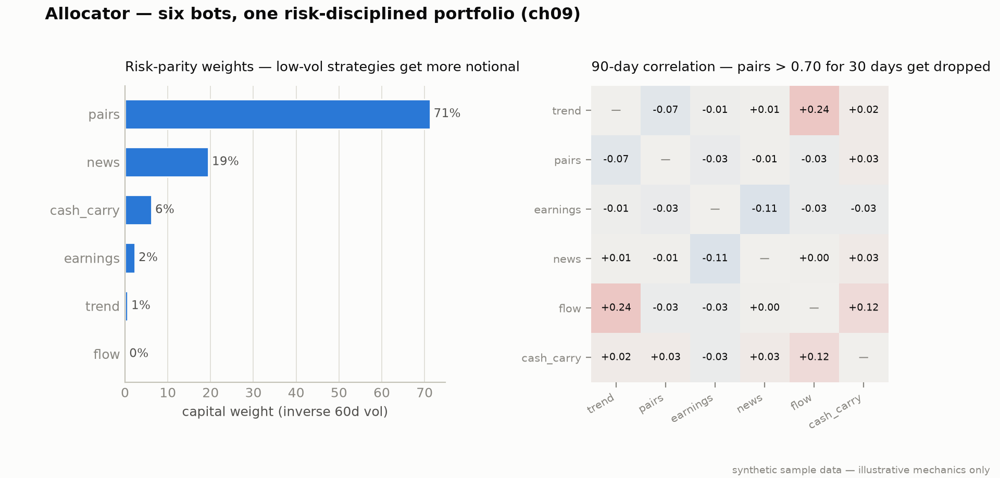

# Strategy 7: The Multi-Bot Portfolio Allocator (Chapter 9)

**Module:** `framework/allocator.py` · **Claude at runtime:** light governance only (~10–20 calls/week in production; none in the demo)

The meta-strategy. Six bots without it are six bots double-trading the same
SPY spread and letting one quiet loser bleed the book.


*Two of the four mechanics, computed live from the synthetic demo window.*

**Notice:** risk parity hands the **biggest weight to the lowest-volatility strategy**. On the synthetic demo window that can be a large single-name slug of capital (run `make demo-ch09` and you will see one bot near 78%).
**Breaks if (concentration risk):** that low volatility is an *artifact*: thin synthetic data, or a strategy that simply hasn't traded much, reads as "calm" and risk parity over-allocates to it. Real books cap each strategy's weight and feed it live volatility. Read these weights as **mechanics, not a ranking**: a 78% weight is not "trust this bot," it is "this bot looked quiet." `make demo-ch09` shows the same weights with a per-strategy cap applied.

The diversification
math (six ~1.0-Sharpe strategies at ~0.3 correlation → portfolio Sharpe
1.5–1.8) only realizes if these four mechanics are enforced in code:

| Mechanic | Rule |
|---|---|
| Risk parity | capital ∝ 1 / 60-day vol, recomputed on a cadence, low-vol strategies get more notional so every bot contributes similar daily risk |
| Correlation monitor | 90-day rolling corr > **0.70 for 30 consecutive days** → drop the lower-Sharpe member |
| Drawdown breaker | **−15% MTD → half size · −25% → zero** until the 90-day Sharpe recovers above **0.5** (no lock files, no manual deletes) |
| Intent netting | gather every strategy's intents per bar, submit **one net order per symbol**: long 100 SPY + short 60 SPY = buy 40, half the fees |

Plus the **$25k broker rule**: below $25k total capital, stay single-broker
(Alpaca + ccxt, skip the futures legs); above it, split per asset class.

## Run it

```bash
python -m framework.allocator --paper --strategies all --capital 100000
python -m framework.allocator --backtest --paper-pass --period 30
```

The demo runs a 120-day warmup (to estimate vols for risk parity) plus a
30-day report window on synthetic data, prints netting events as they happen,
and ends with the unified dashboard: weight, breaker state, MTD P&L, and
90-day Sharpe per strategy, correlation flags, drops, and portfolio totals.

## What the allocator does NOT do (the book is explicit)

- It does not pick which strategies are good: the human owns that.
- It does not predict correlations: the 90-day window is backward-looking
  and honestly ~30 days late to a regime change.
- It does not put Claude on the trade path: governance review only.

---
*Educational reference implementation on synthetic sample data. Not financial advice. See [DISCLAIMER.md](../../DISCLAIMER.md).*
