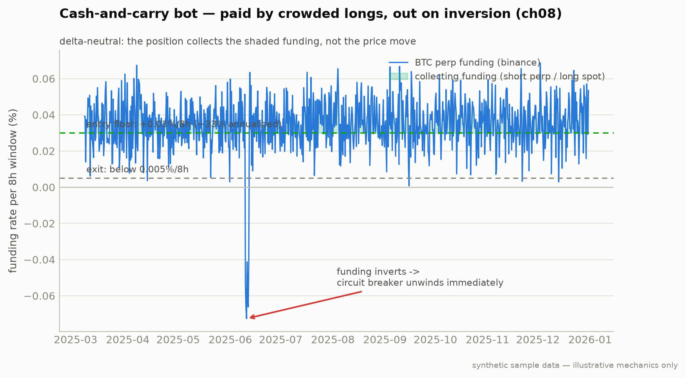

# Strategy 6: Crypto Cash-and-Carry Arbitrage (Chapter 8)

**Module:** `strategies/cash_carry.py` · **Claude at runtime:** none (pure exchange data)

The only crypto strategy in the book, and deliberately the boring one: long
spot + short perp of equal notional, delta-neutral, collecting the funding
payments crowded longs pay every 8 hours. You're not betting on direction.
You're renting your balance sheet to overexcited leveraged longs.



**Notice:** the position only collects while funding sits above the 0.03%/8h floor (shaded). The annotated June dip below zero is the **inversion**: the circuit breaker unwinds *immediately*, no waiting for it to revert.
**Breaks if:** you hold through an inversion hoping it bounces. Negative funding means you now *pay*, and the "delta-neutral" basis can gap on a fast unwind. The breaker is the whole risk model: do not override it.
*The whole strategy in one picture: collect the shaded funding, exit on mean-reversion, unwind instantly on inversion.*

## Rules

| Rule | Value |
|---|---|
| Universe | BTC, ETH, SOL on Binance + Bybit (Hyperliquid optional) |
| Entry | funding rate > **0.03% / 8h window** (≈ 32.85% annualized: 0.03% × 3 × 365) |
| Exits (any of three) | funding < **0.005%/8h** · basis converges ≤ **5 bps** · **funding flips negative → unwind immediately** (circuit breaker) |
| Legs | both fill within **30 seconds** or abort; limit orders at mid |
| Margin | **2–3×** on the short leg, never higher; stop out if short MTM loss > 50% of margin |
| Diversification | ≤ **50%** of strategy capital per exchange · ≤ **33%** per instrument |
| API keys | trading permissions only, **never enable withdrawals** |

## Run it

```bash
python -m strategies.cash_carry --paper --exchanges binance,bybit --instruments BTC,ETH,SOL
python -m strategies.cash_carry --backtest --funding-history 24mo
```

The synthetic funding history includes a deterministic **inversion event**
so the circuit breaker demonstrably fires in the backtest.

## Failure modes

1. **Legs fill at different prices.** Use limit-at-mid + the 30-second abort;
   inter-leg slippage is the strategy's biggest small-money killer.
2. **Short leg approaches liquidation.** The 2–3× margin cap plus the 50%
   stop-out exist so a 30% rally never force-liquidates you.
3. **The exchange goes down.** The 50%-per-exchange rule is the counterparty
   hedge: Mt. Gox and FTX were both "trustworthy" once.

## Backtest caveat

Real historical funding data sometimes omits the worst hours. The book's rule:
confirm coverage of known shock windows before trusting any smooth curve. The
realism pass here also shows how round-trip fees on both legs eat small
funding cycles: a strategy must clear its own frictions (ch11).

---
*Educational reference implementation on synthetic sample data. Not financial advice. See [DISCLAIMER.md](../../DISCLAIMER.md).*
