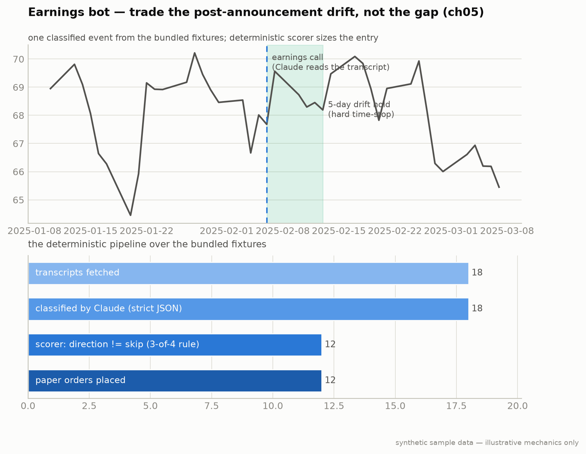

# Strategy 3 — Earnings Drift / PEAD (Chapter 5)

**Module:** `strategies/earnings.py` · **Claude at runtime:** ~1 inference per event (~$0.03–0.05)



**Notice** — the funnel narrows hard: most transcripts classify to "skip," and only high-confidence beats with clean guidance/margins reach a paper order. The 5-day shaded window is the entire hold.
**Breaks if** — you backtest on transcripts from *before* the model's training cutoff: Claude may already "know" the outcome, so the classification is contaminated and the edge is fictional. ch05 evaluates on post-cutoff data only for this reason.
*One fixture event end-to-end, plus the pipeline funnel over all bundled transcripts.*

Post-Earnings Announcement Drift: prices keep moving in the direction of the
surprise for 1–2 weeks after the print. The edge isn't the anomaly (it's in
textbooks); it's that Claude reads the whole call transcript — including the
CFO/COO contradiction a headline scanner can't see — within 30 minutes.

## Pipeline (Claude classifies; Python decides — the ch06 rule)

1. Fetch the transcript (fixtures offline; FMP or similar with an API key).
2. Claude → strict-JSON classification (see [the prompt doc](../prompts/earnings-classifier.md)).
3. `score_classification()` — deterministic, verbatim from the book:
   confidence < 7 → skip; ≥3 bullish fields + 0 bearish → long ×1.0;
   2/0 → long ×0.5; symmetric for shorts; anything mixed → skip.
4. Instrument by **IV-percentile** (pulled fresh at entry): >50 equity,
   <30 ATM option (~30 DTE), 30–50 equity.
5. Exits: hard **5-day** time-stop · −5% equity stop · −50% option stop.
   No discretionary exits — you cannot backtest discretion.

Sizing: 0.5% of equity × the scorer's magnitude.

## Run it

```bash
python -m strategies.earnings --paper --transcript-provider fmp
python -m strategies.earnings --backtest --post-cutoff-only
```

## The honesty rule for LLM strategies

Claude has seen historical transcripts in training. A pre-cutoff backtest is
**contaminated** — treat it as a wiring check only. `--post-cutoff-only`
restricts evaluation to post-training-cutoff dates (look up your model's real
cutoff on Anthropic's models page; the synthetic timeline uses 2025-01-01).

## Failure modes

1. **One field misclassified.** The 3-of-4 threshold absorbs single-field
   errors by design. Don't re-tune the prompt per case.
2. **Transcript arrives late.** Skip the name if it's >4h old — a late PEAD
   entry is worse than none.
3. **Option bought into high IV.** The IV-percentile read must be fresh;
   IV moves intraday on earnings days.

---
*Educational reference implementation on synthetic sample data. The option premium in the offline demo is a fixed-fraction model (see [ERRATA.md](../../ERRATA.md)). Not financial advice. See [DISCLAIMER.md](../../DISCLAIMER.md).*
