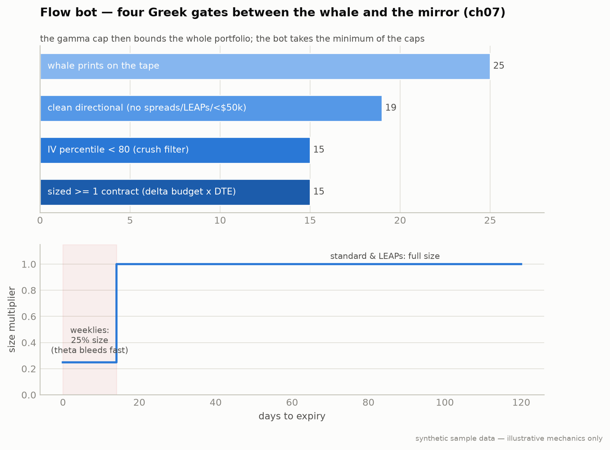

# Strategy 5: Options Flow Whale-Mirror with Greeks (Chapter 7)

**Module:** `strategies/flow.py` · **Claude at runtime:** none (Greeks are arithmetic)

Mirroring the whale's *position* without mirroring the whale's *Greeks
discipline* is how retail bleeds to theta while being right about direction.
Four layers gate every mirror; the bot takes the **minimum of the caps**.



**Notice:** each Greek gate (delta budget → gamma cap → IV-crush filter → theta) throws prints away; the sized mirrors at the bottom are a small fraction of the raw tape. You are copying *risk-adjusted* exposure, not whale headlines.
**Breaks if:** you size by contract count instead of the delta budget. One 0.90-delta print then dwarfs the account; the per-$10k delta budget is the actual risk control, and ch07's printed ×100 snippet (which yields 0 contracts) is superseded by its own worked "four contracts" example.
*How the fixture events thin out gate by gate, and the DTE sizing tiers.*

## Pre-filter, then four layers

| Gate | Rule |
|---|---|
| Clean directional | reject both-sides prints (spreads), notional < $50k, DTE > 180 (LEAP patterns) |
| 1 · Delta budget | 0.20 per $10k of equity → a 0.50-delta print on $10k caps at **4 contracts** |
| 2 · Gamma cap | Σ\|gamma points\| < **50 per $100k** across all open options |
| 3 · IV-crush filter | skip if IV percentile ≥ **80**, applies to calls AND puts |
| 4 · Theta / DTE | weeklies (DTE<14) sized at **25%**; close at **−$0.5/day** theta unless the underlying moved ≥50% toward strike; hard stop in the final **2 days** |

Portfolio brake: open options premium ≤ **5%** of equity (the backtest runner
downsizes to fit).

## Run it

```bash
python -m strategies.flow --paper --flow-provider unusualwhales
python -m strategies.flow --backtest --layers all          # or delta,gamma,iv,theta,dte
```

The paper replay prints every gate's verdict per event: the IV filter
rejecting 30–50% of would-be entries is the honesty check the book demands.
`--layers` runs ablations (each layer on/off) to measure what each one earns.

## Failure modes

1. **You mirrored a hedge, not a bet.** The whale's calls were insurance on a
   long stock book. The IV filter + theta sweep catch most of these.
2. **The gamma cap blocks a trade you "know" is right.** The cap is telling
   you the portfolio is already fully invested in directional risk.
3. **Theta sweep exits the day before the catalyst.** The rule saves you the
   other 80% of the time. Keep it.

## Implementation note

Chapter 7's printed Layer-1 formula is internally inconsistent with its own
worked answer ("Four contracts", stated twice), as printed it yields 0.4 → 0
contracts and the bot would never trade. This implementation honors the worked
example; the full analysis is in [ERRATA.md](../../ERRATA.md). Option P&L in the offline
backtest uses a delta+theta approximation (documented there too).

---
*Educational reference implementation on synthetic sample data. Not financial advice. See [DISCLAIMER.md](../../DISCLAIMER.md).*
