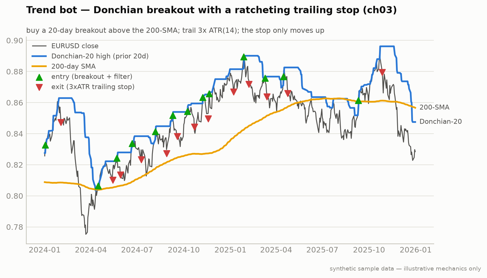

# Bench B2 — FX Trend Following (Appendix B)

**Module:** `strategies/bench/fx_trend.py` · Bench swap for the ch12 rotation

The chapter 3 Donchian rule, unchanged, pointed at a different driver:
central-bank policy divergence instead of equity flows.



**Notice** — these are the *identical* ch03 trend rules on a currency pair; the entry/exit markers behave the same because the mechanic is asset-agnostic. That reuse is the point of the shared chassis.
**Breaks if** — you carry equity-sized risk into FX's leverage. The same rule at 50:1 is a different animal, so B2 halves the risk budget in high-VIX regimes; ignore that and one whipsaw is a margin call.
*Same rules, different driver: the ch03 chart shape on EUR/USD.*

| Rule | Value |
|---|---|
| Instruments | EUR/USD, USD/JPY, GBP/USD via Interactive Brokers (`ib_async`, never `ib_insync`) |
| Entry | 20-day Donchian breakout AND above the 200-day SMA |
| Exit | 3× ATR(14) trailing stop, identical to ch03 |
| Sizing | 1% risk per trade; **0.5% when VIX > 30** (correlations spike) |

```bash
python -m strategies.bench.fx_trend --paper
```

Mind overnight rollover (swap) costs on multi-week holds — small, but they
accumulate.

---
*Educational reference implementation on synthetic sample data. Not financial advice. See [DISCLAIMER.md](../../DISCLAIMER.md).*
