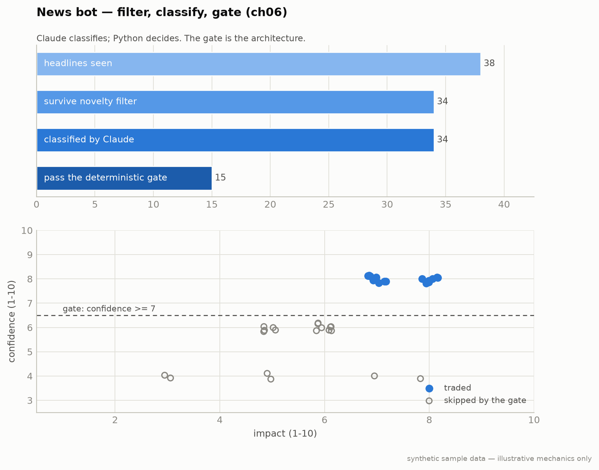

# Strategy 4 — News Sentiment with Claude (Chapter 6)

**Module:** `strategies/news.py` · **Claude at runtime:** heavy (~20 inferences/trade ≈ $0.36)

The load-bearing chapter. A Fed pause is bullish late-cycle and bearish
early-cycle — same headline, opposite trade. Context-reading is exactly what
Claude is for, and exactly where it stops:

> **Claude builds the bot. Deterministic Python rules execute the bot.
> The human owns the strategy.**



**Notice** — the novelty filter and the confidence-≥7 gate discard most headlines; only the filled dots (high impact **and** high confidence) become trades. The gate *is* the architecture.
**Breaks if** — token cost outruns edge: ~20 inferences/trade at ~$0.018 is ~$0.36, and at 50–100 inferences/day the bill is real. If the gross edge per trade is small, inference eats it — which is why ch11 nets it out of every backtest.
*The three-stage pipeline over the bundled headline fixtures; the gate line is the architecture.*

## Three stages

| Stage | Who | What |
|---|---|---|
| 1. Novelty filter | Python | hash (top-5 content tokens) vs a 24h cache — rejects recycled headlines before Claude sees them (70–80% of a raw feed) |
| 2. Classification | Claude | strict JSON: impact 1-10, direction, asset ∈ {SPY, QQQ, EUR/USD, GLD, BTC, none}, confidence, rationale ([prompt doc](../prompts/news-classifier.md)) |
| 3. Gate + sizing | Python | `should_trade()`: confidence ≥ 7 AND direction ≠ skip AND asset ≠ none AND < 3 open positions AND MTD drawdown ≤ 5% |

Sizing: 0.5% risk / (1.5 × ATR(14)) stop. Exits: 2-hour soft stop (close unless
the move is ≥ +0.5%), 24-hour hard stop. The constrained asset list is the
architecture — the bot cannot invent an instrument.

## Run it

```bash
python -m strategies.news --paper --feeds bloomberg,reuters,fed
python -m strategies.news --backtest --inference-cost-track
```

The CLI prints the inference cost of every run — the news bot must clear its
own token bill (ch11: ~$0.018/inference; ~$0.36/trade at production depth).

## Failure modes

1. **Fake-news flush.** Claude classifies a rumor as real; the 2-hour exit is
   the protection. Every fake flush feels real for 90 minutes.
2. **Token costs eat the edge.** Track them (this repo nets them in the
   realism pass). If the gross edge is $5/day and inference is $1.80, rethink.
3. **The gate "over-rejects".** Trading 2–3×/week is the design. Broaden the
   feed list, never lower the confidence floor.

## Backtest honesty

You cannot replay history through Claude — it has memorized the headlines.
Pre-cutoff results are wiring checks; the honest evaluation is live paper on
post-cutoff headlines (6–12 months for meaningful sample size).

---
*Educational reference implementation on synthetic sample data. Not financial advice. See [DISCLAIMER.md](../../DISCLAIMER.md).*
