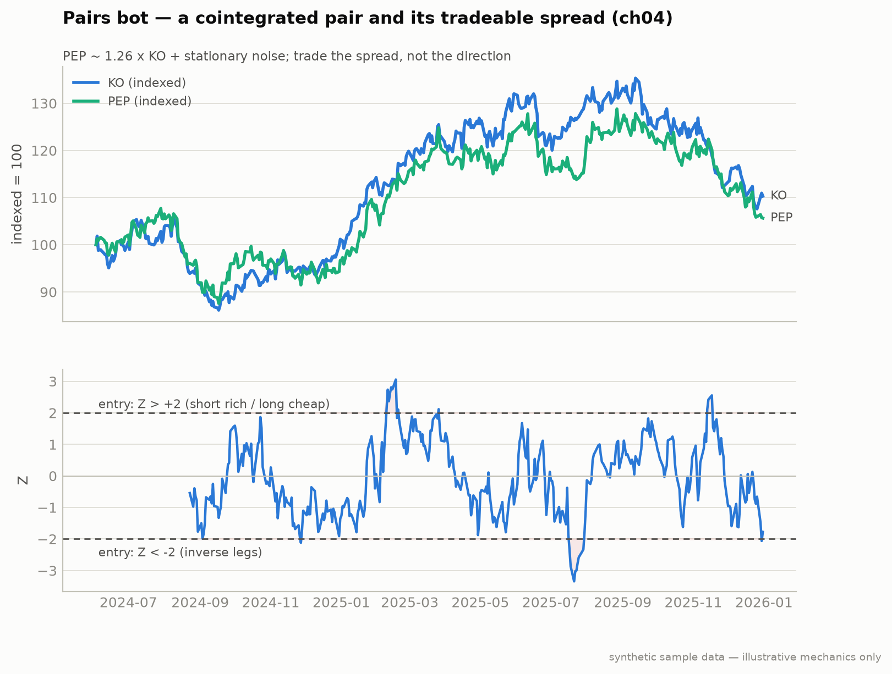

# Strategy 2: Mean Reversion with Pairs (Chapter 4)

**Module:** `strategies/pairs.py` · **Claude at runtime:** none (statistics)



**Notice:** trades open only when the Z-score pierces ±2 and close as it reverts toward 0. The edge is *mean reversion of the spread*, not a directional bet on either name.
**Breaks if:** the pair stops being cointegrated (a structural break in one company). The spread then trends instead of reverting and ±2 entries keep adding to a loser, which is exactly why the p<0.05 re-test and the 20-day time-stop exist.
*The engineered KO/PEP pair and the Z-score the bot actually trades.*

Trade the snap-back of a *cointegrated* spread, not a correlated one. Correlation
is a property of returns; **cointegration** is a structural link between price
levels (Engle-Granger test on the residuals). Two random walks can be correlated;
only a cointegrated pair has a spread that's statistically pulled back to a mean.

## Rules

| Rule | Value |
|---|---|
| Candidate basket | KO/PEP, XLE/USO, GLD/SLV, MSFT/GOOGL, *candidates the test evaluates* |
| Tradeable | Engle-Granger `coint(y0, y1, trend='c', method='aeg')` p-value **< 0.05** |
| Hedge ratio | OLS slope `np.polyfit(y0, y1, 1)[0]`; short leg notional = long × hedge |
| Entry | spread Z-score beyond **±2.0** (60-day rolling mean/std): short the rich, long the cheap |
| Exit | Z crosses zero, or a hard **20-trading-day time-stop** |
| Regime filter | **VIX > 30** → no new entries (Policy A: open trades ride out under the time-stop) |
| Sizing / caps | **0.5%** risk per pair · max **5** simultaneous pairs |
| Look-ahead fix | cointegration re-tested on a rolling **252-day** window ending *yesterday* |

**The stop-loss paradox:** a pairs trade that moves against you has *more*
statistical edge, not less, so there is no price stop. The time-stop and the
VIX filter bound the risk instead.

## Run it

```bash
python -m strategies.pairs --paper --basket sectors
python -m strategies.pairs --backtest --rolling-coint --window 252
python -m strategies.pairs --paper --basket custom --pairs KO,PEP GLD,SLV
```

## Failure modes

1. **Scanner returns zero pairs.** Expand the basket; never weaken the p-value.
2. **Time-stop fires right before the revert.** The 20-day rule protects you
   from the trade that doesn't revert in 60. Keep it.
3. **VIX crosses 30 mid-trade.** Pick a policy and stick to it: this repo
   implements Policy A (ride out under the time-stop, no new entries).

---
*Educational reference implementation on synthetic sample data (KO/PEP is constructed cointegrated so the demo always has a live example). Not financial advice. See [DISCLAIMER.md](../../DISCLAIMER.md).*
