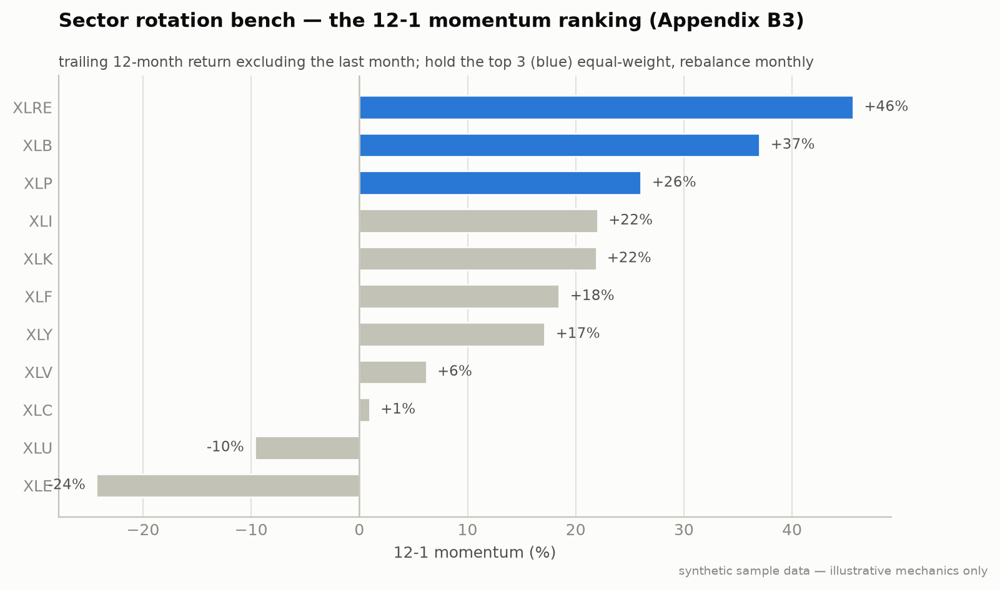

# Bench B3: Sector Momentum Rotation (Appendix B)

**Module:** `strategies/bench/sector_rotate.py` · Bench swap for the ch12 rotation

The standard 12-1 momentum factor on the 11 GICS sector ETFs, a slow factor
strategy, deliberately uncorrelated to VRP (vol) and FX trend (currency).



**Notice:** only the **top three** by 12-1 momentum are held, equal weight. The *ranking* is the signal, not any single ETF; next month's ranking rotates the book.
**Breaks if:** momentum reverses sharply (a factor crash). The 12-1 lookback is slow, so it rotates into last month's winners right as they roll over, the known failure mode of momentum, and why it is a *bench* diversifier, not a core sleeve.
*The monthly ranking; only the three blue bars get held.*

| Rule | Value |
|---|---|
| Universe | XLK XLV XLF XLY XLP XLE XLI XLB XLU XLRE XLC |
| Signal | trailing 12-month return **excluding the most recent month** (12-1) |
| Portfolio | hold the **top 3**, equal weight |
| Rebalance | first trading day of each month; drop fallers, add risers |

```bash
python -m strategies.bench.sector_rotate --paper
```

Expect 15–25% drawdowns in momentum-crash regimes (early 2009, late 2018,
2022). It works over multi-year horizons; do not evaluate it after one bad
quarter.

---
*Educational reference implementation on synthetic sample data. Not financial advice. See [DISCLAIMER.md](../../DISCLAIMER.md).*
