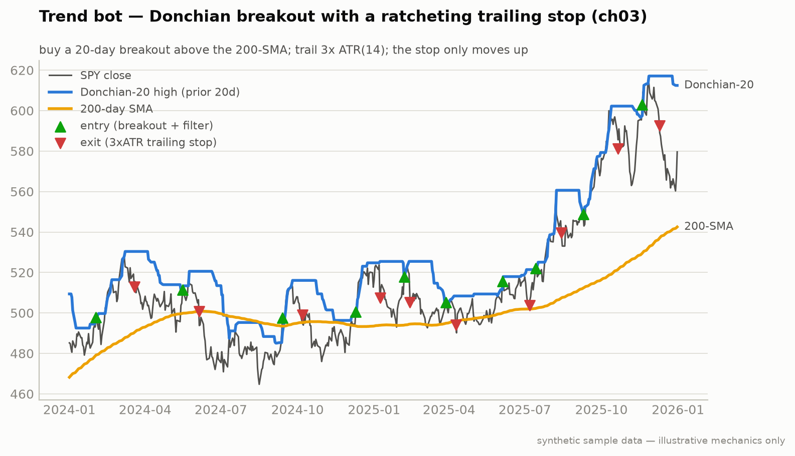

# Strategy 1 — Trend Following (Chapter 3)

**Module:** `strategies/trend.py` · **Claude at runtime:** none (mechanical rules)


*All three rules on one chart — regenerate with `python tools/generate_docs_charts.py`.*

**Notice** — entry triangles appear *only* where price breaks the prior-20-day high **and** sits above the 200-day SMA. Most of the series carries no marker at all; the empty stretches are the strategy working, not idling.
**Breaks if** — you drop the 200-SMA regime filter: breakouts then fire inside downtrends too, and the losers on the wrong side of the trend erase the winners. The filter is the edge, not decoration.

Buy what just made a new high, inside a long-term uptrend, and trail a wide stop.
Trend persistence is a behavioral anomaly — people anchor, institutions rebalance
slowly — and it survives publication because the behavior generating it doesn't stop.

## Rules (all three, verbatim from the book)

| Rule | Value |
|---|---|
| Entry | close > highest high of the **prior 20** trading days (Donchian breakout) |
| Regime filter | close > **200-day SMA** — long entries only above it |
| Exit | trailing stop at **3× ATR(14)** below the high-water mark; the stop **only ratchets up** |
| Instruments | SPY, QQQ (Alpaca) · ES, GC (IBKR — the broker router handles it) |
| Sizing | `position size = risk dollars / stop distance`, risk **1%** of equity per trade |

Worked example (the one the book says to memorize): $10,000 account, 1% risk = $100.
SPY at $588 with a $4 ATR → stop distance $12 → **8 shares**. Not 100. Eight.

## Run it

```bash
python -m strategies.trend --paper --instruments SPY,QQQ,ES,GC
python -m strategies.trend --backtest --regime-breakdown
```

Sample paper-scan output:

```
[trend] SPY: no signal (close 579.61, 20d-high 612.46, 200-SMA 542.52)
```

"No signal" for weeks at a time is **normal** — the Donchian + SMA pair
deliberately excludes choppy regimes.

## Failure modes the book warns about

1. **The bot sits in cash for two weeks and you start poking at parameters.**
   Don't. The absence of signals is the signal.
2. **Stopped at breakeven, then the trend resumes without you.** The cost of
   trailing stops. Stay at 3× ATR; widening to 4× loses more over 100 trades.
3. **One instrument carries the P&L and you want to concentrate.** That's
   overfitting in real time. Keep the four-instrument basket, equal notional.

## Implementation notes

- The chapter's prose defines the breakout against the *prior* 20 days; the
  rolling max is therefore shifted one bar (a close can never exceed a rolling
  max that includes its own high). See [book-reconciliations.md](../book-reconciliations.md).
- ATR here is the simple rolling mean of true range, exactly as the book's
  snippet computes it.

---
*Educational reference implementation on synthetic sample data. Not financial advice. See [DISCLAIMER.md](../../DISCLAIMER.md).*
