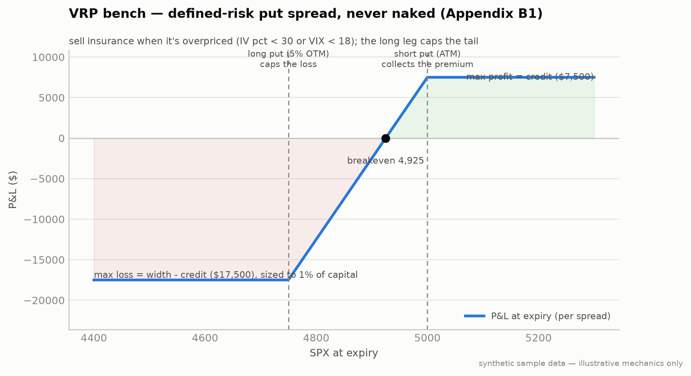

# Bench B1 — Volatility Risk Premium (Appendix B)

**Module:** `strategies/bench/vrp.py` · Bench swap for the ch12 rotation

Implied volatility is structurally bid above realized — traders overpay for
insurance. Sell it, defined-risk only.



**Notice** — the payoff is capped **both** ways: max profit = the credit collected, max loss = strike width − credit. This is a *defined-risk* premium sale, not naked short vol.
**Breaks if** — you sell it when IV is already low (you collect little premium for the same tail), or you size past the max loss you can absorb on a gap-down. Defined risk only protects you if the position size respects the "max loss / spread" number.
*Defined risk means the hockey stick has a floor: the long leg caps the tail.*

| Rule | Value |
|---|---|
| Entry | SPX IV percentile < **30** OR VIX < **18**, and < **3** open spreads |
| Structure | sell ATM put + buy a put **5% further OTM**, 30–45 DTE (the long leg caps the loss — never naked) |
| Exits | **50%** of max profit captured · DTE ≤ **5** · underlying breaches the long strike (cut immediately) |
| Sizing | max loss per spread ≤ **1%** of strategy capital |

```bash
python -m strategies.bench.vrp --paper
```

Bench rotation protocol (Appendix B4): rotate in on a calendar month boundary,
paper for 30 days at Stage-1 sizing, then climb the ch12 ladder. Never
"swap in and deploy live."

---
*Educational reference implementation; spread pricing in the offline demo is a simplified credit model (see [book-reconciliations.md](../book-reconciliations.md)). Not financial advice. See [DISCLAIMER.md](../../DISCLAIMER.md).*
